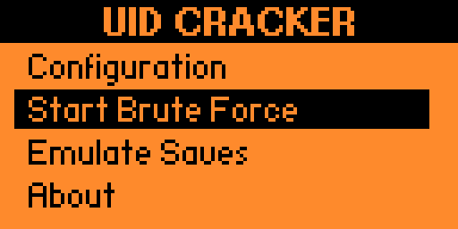
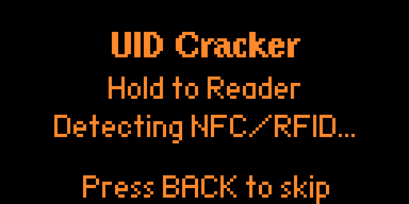
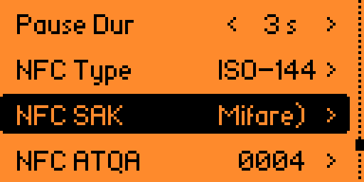
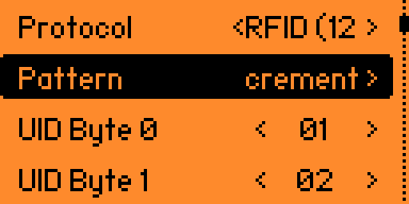
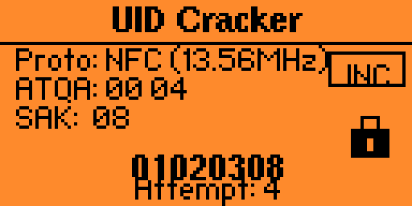

# **UIDCracker - Flipper Zero Security Tool**

---

## 🌍 Overview / Genel Bakış

**[EN]** UIDCracker is a professional security research tool designed for the Flipper Zero. It enables authorized security auditors to analyze access control systems by emulating and brute-forcing NFC, RFID, and iButton UIDs using intelligent pattern detection.

**[TR]** UIDCracker, Flipper Zero için tasarlanmış profesyonel bir güvenlik araştırma aracıdır. Yetkili güvenlik denetçilerinin; akıllı örüntü algılama kullanarak NFC, RFID ve iButton UID'lerini emüle etmesine ve kaba kuvvet (brute-force) saldırılarıyla erişim kontrol sistemlerini analiz etmesine olanak tanır.

---

## 📸 Interface & Explorer / Arayüz ve Gezgin

### 🟢 Main Navigation
The interface follows the Flipper Zero's aesthetics while providing a "Hacker Terminal" feel.

*`MENU.png` - The primary command center of UIDCracker.*

### 🟠 Reader Explorer
Use the Reader Explorer to automatically identify the protocol being used by a reader or a card.

*`Reader_explorer.png` - Real-time protocol detection (NFC / RFID / iButton).*

---

## ✨ Primary Features / Temel Özellikler

### 🔍 Protocol Support / Protokol Desteği
*   **NFC (13.56MHz)**: ISO14443-3A support.
*   **RFID (125kHz)**: Common proximity card support (EM4100, HIDProx, Indala, AWID).
*   **iButton (Dallas)**: 1-Wire protocol key emulation.

### 🧠 Pattern Engine / Örüntü Motoru
UIDCracker uses a **Pattern Engine** to generate UIDs based on logic:
- `+1 / -1`: Simple linear increment/decrement.
- `+K`: Fixed step jumps (16, 32, 64, etc.).
- `16-bit Counter`: Little-endian logic for industrial systems.
- `Bitmask`: Targeted attacks on specific bits.
- `Random`: Entropy-based testing.

---

## ⚡ Advanced Workflows / Gelişmiş Kullanım Senaryoları

### 💾 Saving Found Cards / Bulunan Kartları Kaydetme
**[EN]** When you stop a brute-force attack or find a working UID, the application allows you to **Save** the current UID directly to your SD card. This ensures you never lose a successful "hit".
**[TR]** Bir brute-force saldırısını durdurduğunuzda veya çalışan bir UID bulduğunuzda, uygulama mevcut UID'yi doğrudan SD kartınıza **kaydetmenize (Save)** olanak tanır. Bu sayede başarılı sonuçları asla kaybetmezsiniz.

### 🔄 Derivative Discovery (Emulate Saves) / Türev Tespiti
**[EN]** Found a card and want to find its "siblings"? Use **Emulate Saves** to load previously saved cards from the device memory. Once loaded, you can apply patterns (like +1 or Bitmask) around that specific card to detect derivatives and other valid UIDs in the same system.
**[TR]** Bir kart bulup onun "kardeşlerini" mi arıyorsunuz? Cihaz hafızasındaki daha önce kaydedilmiş kartlara erişmek için **Emulate Saves** özelliğini kullanın. Kart yüklendikten sonra, aynı sistemdeki türevleri ve diğer geçerli UID'leri tespit etmek için o karta özel örüntüler (örneğin +1 veya Bitmask) uygulayabilirsiniz.

---

## ⚙️ Configuration / Yapılandırma
Adjust your attack parameters for maximum efficiency and hardware stability.

| 🟠 NFC Config | 🟢 RFID Config |
| :---: | :---: |
|  |  |
| *`NFC_config.png`* | *`RFID_conifg.png`* |

---

## 🚀 Step-by-Step Guide / Adım Adım Rehber

### 🇬🇧 English
1.  **Detection**: Run `Reader Explorer` to identify the system type.
2.  **Base Card**: Load a card via `Configuration` or use `Emulate Saves` to pick a stored one.
3.  **Pattern**: Select a logic (e.g., Incremental) to search for derivatives.
4.  **Execute**: Start `Start Brute Force`.
5.  **Stop & Save**: Once a result is found, press **Stop** and then **Save** to keep the UID.

### 🇹🇷 Türkçe
1.  **Tespit**: Sistem tipini belirlemek için `Reader Explorer` çalıştırın.
2.  **Temel Kart**: `Configuration` üzerinden bir kart okutun veya kayıtlı bir kartı seçmek için `Emulate Saves` kullanın.
3.  **Örüntü**: Türevleri aramak için bir mantık (örn: Incremental) seçin.
4.  **Çalıştır**: `Start Brute Force` modunu başlatın.
5.  **Durdur ve Kaydet**: Bir sonuç bulduğunuzda, **Stop** tuşuna basın ve ardından UID'yi saklamak için **Save** seçeneğini seçin.

*`Brute_Screen.png` - Active emulation and progress tracking.*

---

## 💡 Visual Feedback (LEDs) / Görsel Geri Bildirim

UIDCracker communicates hardware status via LEDs:
- 🔵 **Blue**: NFC reading active.
- 🟢 **Green**: RFID reading active.
- 🟡 **Yellow**: iButton active or system Paused.
- 🔴 **Red Pulse**: Brute-force cycle / Emulation active.
- 💠 **Cyan**: Successful card capture or file save.
- 🏮 **Red Flash**: Error or Security Lockout.

---

## 🔐 Security & Activation / Güvenlik ve Aktivasyon
**[EN]** For first-time use, the app requires a device-specific activation password. This ensures the tool is used by the authorized owner of the Flipper Zero. You can contact me via **Instagram, TikTok, or other social media** platforms to obtain your activation password.

**[TR]** İlk kullanımda uygulama, cihaza özel bir aktivasyon şifresi gerektirir. Bu, aracın Flipper Zero'nun yetkili sahibi tarafından kullanılmasını sağlar. Kullanım şifresi için benimle **Instagram, TikTok vb. sosyal medya** uygulamaları üzerinden iletişime geçebilirsiniz.

---

## ⚠️ Legal Disclaimer / Yasal Uyarı

**[EN]** This tool is developed for **educational and authorized security testing purposes only**. The developer assumes no responsibility for any unauthorized use, damages, or legal consequences resulting from the use of this software. Always obtain explicit permission before testing any system.

**[TR]** Bu araç **yalnızca eğitim ve yetkili güvenlik testi amaçları için** geliştirilmiştir. Geliştirici, bu yazılımın yetkisiz kullanımından, yol açabileceği zararlardan veya yasal sonuçlardan hiçbir şekilde sorumlu tutulamaz. Herhangi bir sistemi test etmeden önce her zaman açık izin alın.

---

  
<b>Developed with ⚡ for the Flipper Zero Community</b>

